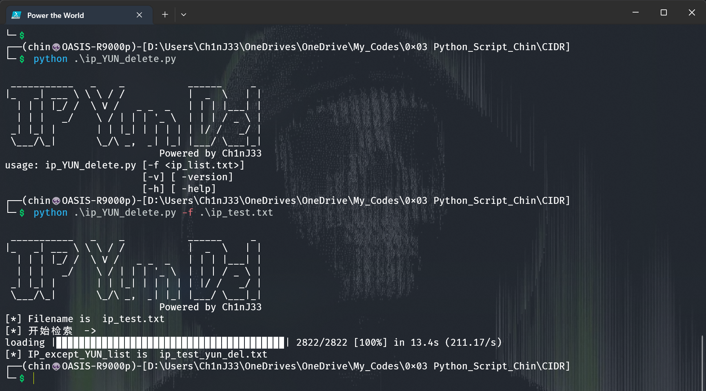

# IP 辨别，将云厂商Ip删除

### Author：Ch1nJ33

https://github.com/ch1nj33

## 环境：[python3]

### 用途：从ip列表中检索出云厂商的ip，并将其删除。

### install

```shell
pip install ./install_files/IPy-1.01.tar.gz
pip install ./install_files/about-time-4.2.1.tar.gz
pip install ./install_files/grapheme-0.6.0.tar.gz
pip install ./install_files/alive_progress-3.1.4-py3-none-any.whl
```


### **usage** :

```shell
python ip_YUN_delete.py[-f <ip_list.txt>]
```


### 运行截图


